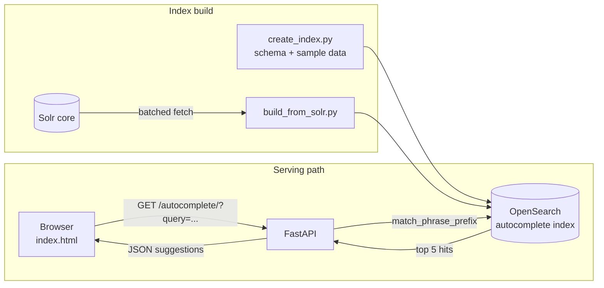

# Autocomplete API

A working autosuggest service built with [FastAPI](https://fastapi.tiangolo.com/) and [OpenSearch](https://opensearch.org/): a REST endpoint that returns type-ahead suggestions as the user types, backed by an OpenSearch index with a custom autocomplete analyzer. Includes a demo web page, an index bootstrap script with sample data, and a loader that populates the index from an existing Solr core.

## How it works



The index uses a custom analyzer for the `name` field, and queries use `match_phrase_prefix` with bounded expansions, so suggestions stay fast and relevant even as the index grows. The API returns the top five matches as JSON.

## Setup

Make sure OpenSearch is installed and running on `localhost:9200`.

```bash
python3 -m venv venv
source venv/bin/activate
pip install -r requirements.txt
```

Create the index and load sample data (a list of ingredient names):

```bash
python3 ./create_index.py
```

Or populate it from an existing Solr core instead:

```bash
python3 ./build_from_solr.py
```

## Run

```bash
uvicorn main:app --reload
```

Then open `index.html` in a browser and start typing, or query the API directly:

```bash
curl "http://localhost:8000/autocomplete/?query=app"
```

A ready-made request collection is included in `test_main.http` for IDE-based testing.

## License

MIT. See [LICENSE](LICENSE).
